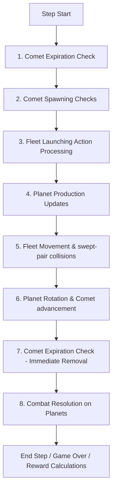

# Orbit Wars C Simulator: Technical Specification and Parity Guide

This document provides a comprehensive technical reference for the high-performance C-based Orbit Wars simulator (`ocean/orbit_wars/orbit_wars.h`, `binding.c`) in comparison to the original Python `kaggle_environments` Orbit Wars implementation (`orbit_wars.py`).

---

## 1. Directory Structure and Component Mapping

For a new agent or developer starting from scratch, the environment's files are structured as follows:

- **[ocean/orbit_wars/orbit_wars.h](file:///home/dima/dev/PufferLib-4.0/ocean/orbit_wars/orbit_wars.h)**: Core C simulation engine. Implements game states, Turn phases (spawning, movement, continuous swept-pair collision, combat, and scoring), and observation mapping.
- **[ocean/orbit_wars/binding.c](file:///home/dima/dev/PufferLib-4.0/ocean/orbit_wars/binding.c)**: PufferLib 4.0 C-binding layer. Exposes C lifecycle wrappers (`c_reset`, `c_step`, `c_close`), maps Contiguous Flat Memory pointers, and sets up player permutations (`my_setup_perm`) for training.
- **[config/orbit_wars.ini](file:///home/dima/dev/PufferLib-4.0/config/orbit_wars.ini)**: Hyperparameter configuration file defining self-play settings, training device pathways, agent count, thread counts, and model sizes.
- **[tests/test_orbit_wars.py](file:///home/dima/dev/PufferLib-4.0/tests/test_orbit_wars.py)**: Vectorization smoke tests, range validators, termination checks, and execution speed benchmarks.
- **[tests/test_orbit_wars_parity.py](file:///home/dima/dev/PufferLib-4.0/tests/test_orbit_wars_parity.py)**: C vs. Python mathematical parity suite. Asserts frame-by-frame equivalence across physical rollouts and custom edge-case scenarios.

---

## 2. Memory Layout and ctypes Structure Mapping

To enable direct memory injection and observation assertions in the parity test suite, the C structures match standard Python `ctypes.Structure` layouts with 1-to-1 member alignments:

| Entity | C Struct Type (`orbit_wars.h`) | Python ctypes Class (`test_orbit_wars_parity.py`) | Description |
| :--- | :--- | :--- | :--- |
| **Planet** | `PlanetC` (40 bytes) | `class PlanetC(ctypes.Structure)` | Represents static, orbiting, and comet-planets. |
| **Fleet** | `FleetC` (64 bytes) | `class FleetC(ctypes.Structure)` | Represents active traveling ship fleets. |
| **Comet Group** | `CometGroupC` (6440 bytes) | `class CometGroupC(ctypes.Structure)` | Holds symmetric coordinate deflection paths for comets. |
| **Action** | `RawActionC` (16 bytes) | `class RawActionC(ctypes.Structure)` | Decoded flight instruction `[from_planet, angle, ships]`. |
| **Simulator** | `OrbitWars` (95368 bytes) | `class OrbitWarsStruct(ctypes.Structure)` | Contiguous state space of the simulator. |

> [!IMPORTANT]
> To prevent micro-drift and numerical bifurcation across multiple simulation steps, all coordinate, orbital, and flight trajectory variables use **double precision floating point** (`double` in C, `ctypes.c_double` in Python).

---

## 3. Turn Execution Phase Order

To ensure exact physics equivalence across steps, both C and Python environments execute simulation phases in the identical chronological sequence:



### Physical Equivalence Formulas
1. **Fleet launch offset**: Fleets spawn just outside the planet's boundaries to prevent immediate self-collision:
   $$\text{spawn\_x} = \text{planet\_x} + (\text{planet\_radius} + 0.1) \times \cos\theta$$
   $$\text{spawn\_y} = \text{planet\_y} + (\text{planet\_radius} + 0.1) \times \sin\theta$$
2. **Non-linear speed scaling**: Fleet speed is mathematically proportional to the log of the traveling army size:
   $$\text{speed} = \min\left(1.0 + (\text{max\_speed} - 1.0) \times \left(\frac{\ln(\text{ships})}{\ln(1000)}\right)^{1.5}, \text{max\_speed}\right)$$
3. **Swept-pair continuous collision checking**: Fleets do not "tunnel" through moving planets. We approximate flight trajectories as chord segments and resolve intersections using continuous swept-pair calculations:
   - Python: `swept_pair_hit(A, B, P0, P1, r)`
   - C: `ow_swept_pair_hit(ax, ay, bx, by, p0x, p0y, p1x, p1y, radius)`

---

## 4. Observation and Reward Layouts

### Observation Scaling (Contiguous Array: 6484 Floats per Agent)
Observations are generated symmetrically relative to the observing player `a` and cast to `float` bounds:
- **Relative Ownership**: `0` for ego (player `a`), `1..3` for relative opponents, `-1` for neutral.
- **Board Coordinates**: Normalized to `[0.0, 1.0]` by dividing by `OW_BOARD_SIZE` (`100.0f`).
- **Army Densities**: Normalized by dividing by `1000.0f` to keep inputs stable during high ship accumulations.
- **Planet Radii / Production Rates**: Scaled by dividing by `5.0f`.
- **Flight Angles**: Normalized to `[0.0, 1.0]` by dividing by `2 * M_PI`.

### Reward Mappings
Rewards are terminal outcomes calculated at the end of the episode:
- **Winner**: `1.0f`
- **Draw/Tie**: `0.5f`
- **Loser**: `0.0f`
- **Non-terminal steps**: `0.0f`

---

## 5. Self-Play, Tags, and Swap Boundaries

To support historical self-play training, the binding includes environment tagging (`#define MY_USES_TAGS`):
- `tag`: Index indicating if the opponent is active or a frozen model.
- `boundary_reached`: Set to `1` by the C simulator on the frame the episode ends. PufferLib monitors this flag to swap frozen historical policies at turn boundaries.

---

## 6. Build and Verification Commands Cheat Sheet

### 1. Build PufferLib C Environment (Local Machine)
```bash
# Compile CPU backend
bash build.sh orbit_wars --cpu
```

### 2. Run Test Suites (Local Machine)
```bash
# Run PufferLib Vectorization and Benchmark Suite
.venv/bin/python tests/test_orbit_wars.py

# Run C vs Python Parity Suite
.venv/bin/python tests/test_orbit_wars_parity.py
```

### 3. Run Google Colab Verification (From Local Machine)
The Colab setup and test scripts are decoupled to prevent cell execution timeouts. Run them in order:
```bash
# 1. Start a new Colab session and install dependencies
colab new
colab exec -f colab_setup.py

# 2. Compile latest changes and run Vector/Benchmark checks (saves to colab_build_run.log)
colab exec -f colab_build.py 2>&1 | tee colab_build_run.log

# 3. Run full physical and observation parity verification (saves to colab_parity_run.log)
colab exec -f colab_parity.py 2>&1 | tee colab_parity_run.log
```
