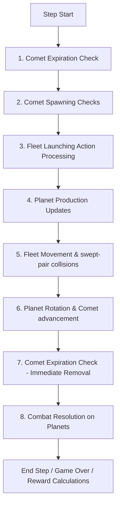

# Orbit Wars C Simulator: Technical Specification and Parity Guide

This document provides a comprehensive technical reference for the high-performance C-based Orbit Wars simulator (ocean/orbit_wars/orbit_wars.h, binding.c) in comparison to the original Python kaggle_environments Orbit Wars implementation (orbit_wars.py). It documents the memory alignment, turn phases, continuous physics equations, observation layouts, self-play boundaries, and verification suites.

---

## 1. Directory Structure and Component Mapping

For a new agent or developer starting from scratch, the environment's files are structured as follows:

- [ocean/orbit_wars/orbit_wars.h](file:///home/dima/dev/PufferLib-4.0/ocean/orbit_wars/orbit_wars.h): Core C simulation engine. Implements game states, Turn phases (spawning, movement, continuous swept-pair collision, combat, and scoring), and observation mapping.
- [ocean/orbit_wars/binding.c](file:///home/dima/dev/PufferLib-4.0/ocean/orbit_wars/binding.c): PufferLib 4.0 C-binding layer. Exposes C lifecycle wrappers (c_reset, c_step, c_close), maps Contiguous Flat Memory pointers, and sets up player permutations (my_setup_perm) for training.
- [config/orbit_wars.ini](file:///home/dima/dev/PufferLib-4.0/config/orbit_wars.ini): Hyperparameter configuration file defining self-play settings, training device pathways, agent count, thread counts, and model sizes.
- [tests/test_orbit_wars.py](file:///home/dima/dev/PufferLib-4.0/tests/test_orbit_wars.py): Vectorization smoke tests, range validators, termination checks, and execution speed benchmarks.
- [tests/test_orbit_wars_parity.py](file:///home/dima/dev/PufferLib-4.0/tests/test_orbit_wars_parity.py): C vs. Python mathematical parity suite. Asserts frame-by-frame equivalence across physical rollouts and custom edge-case scenarios.

---

## 2. Memory Layout and ctypes Structure Mapping

To enable direct memory injection and observation assertions in the parity test suite, the C structures match standard Python ctypes.Structure layouts with 1-to-1 member alignments:

### Planet Struct Layout (PlanetC)
- C representation: PlanetC (40 bytes)
- Python representation: class PlanetC(ctypes.Structure)
- Fields:
  - id (int/c_int): Unique identifier.
  - owner (int/c_int): Owning player index (0-3 or -1).
  - x (double/c_double): X position.
  - y (double/c_double): Y position.
  - radius (double/c_double): Radius of the planet.
  - ships (int/c_int): Garrison size.
  - production (int/c_int): Production rate.
  - is_comet (int/c_int): Boolean flag.
  - active (int/c_int): Allocation activity flag.

### Fleet Struct Layout (FleetC)
- C representation: FleetC (64 bytes)
- Python representation: class FleetC(ctypes.Structure)
- Fields:
  - id (int/c_int): Unique identifier.
  - owner (int/c_int): Owner index.
  - x, y (double/c_double): Fleet position coordinates.
  - angle (double/c_double): Angle of travel.
  - from_planet_id (int/c_int): Source planet.
  - ships (int/c_int): Size of fleet.
  - speed (double/c_double): Velocity.
  - active (int/c_int): Allocation activity flag.

### Comet Group Layout (CometGroupC)
- C representation: CometGroupC (6440 bytes)
- Python representation: class CometGroupC(ctypes.Structure)
- Fields:
  - planet_ids (int * 4): Planet IDs corresponding to the 4 comets in the group.
  - path_index (int): Index of current step along the trajectory path.
  - num_steps (int): Total steps in path (usually 100).
  - paths_x (double[4][100]): Pre-generated X-coordinates.
  - paths_y (double[4][100]): Pre-generated Y-coordinates.
  - active (int): Activity flag.

### Core Environment Layout (OrbitWars)
- C representation: OrbitWars (95,368 bytes standard, 199,112 bytes under `PARITY_TESTING`)
- Python representation: class OrbitWarsStruct(ctypes.Structure) (always 199,112 bytes for parity testing)
- Fields:
  - log (Log): PufferLib metric logs.
  - client, observations, actions, rewards, terminals (void_p): Routing pointers.
  - tag (int): Opponent category marker.
  - boundary_reached (int): Episode terminal boundary indicator.
  - obs_ptr, action_ptr, reward_ptr, terminal_ptr: Permuted routing tables.
  - slot_for_color (int * 4): Shuffled agent-to-environment color mapping.
  - num_agents, max_steps, rng: Environment constraints.
  - planets (PlanetC * 48), num_planets: Planet tracking buffers.
  - fleets (FleetC * 1024): Fleet buffers.
  - comet_groups (CometGroupC * 5), num_comet_groups: Comet trackers.
  - raw_actions, num_raw_actions: Action tables.
  - angular_velocity, next_fleet_id, next_planet_id, current_step: Physics states.
  - planet_angle (double * 48), planet_orbital_radius (double * 48), planet_orbits (int * 48): Orbital specs.
  - arriving_ships (int[48][4]): Queue for combat grouping.
  - prevent_reset: Debug marker.
  - raw_observations (float[4][6484]): Conditionally included when `PARITY_TESTING` is defined, used to hold unscaled observations for verification.

> [!IMPORTANT]
> To prevent floating-point divergence, all coordinates, orbits, speeds, and headings are stored and calculated in double precision (double / c_double). Observations are cast to float only at output mapping.

---

## 3. Turn Execution Phase Order

To ensure exact physics equivalence, both implementations execute simulation phases in the identical chronological sequence:



### Physical Equivalence Formulas

1. Fleet Launch Offset:
   $$\text{spawn\_x} = \text{planet\_x} + (\text{planet\_radius} + 0.1) \times \cos(\theta)$$
   $$\text{spawn\_y} = \text{planet\_y} + (\text{planet\_radius} + 0.1) \times \sin(\theta)$$
2. Speed Scaling:
   $$\text{speed} = \min\left(1.0 + (\text{max\_speed} - 1.0) \times \left(\frac{\ln(\text{ships})}{\ln(1000)}\right)^{1.5}, \text{max\_speed}\right)$$
3. Swept-Pair Continuous Collision Checking:
   Continuous swept-pair collision calculates whether a fleet line segment intersects a moving circular planet body.
   - Python implementation: swept_pair_hit(A, B, P0, P1, r)
   - C implementation: ow_swept_pair_hit(ax, ay, bx, by, p0x, p0y, p1x, p1y, radius)

---

## 4. Function-to-Function Correspondence

| Python Function (orbit_wars.py) | C Function / Phase (orbit_wars.h) | Description |
| :--- | :--- | :--- |
| generate_planets(rng) | ow_generate_map(env) | Sets up the initial map of symmetric static and orbiting planets. |
| generate_comet_paths(...) | ow_generate_comet_path(env, idx) | Simulates gravity deflection of 4 symmetric comet trajectories. |
| interpreter(...) (Launch) | ow_phase_fleet_launch(env) | Spawns fleets at dynamic coordinates outside planets based on inputs. |
| interpreter(...) (Production) | ow_phase_production(env) | Increments owned planets' ship counts by their production values. |
| interpreter(...) (Swept Collision) | ow_phase_fleet_movement(env) | Simulates continuous swept-pair checks with moving planets/sun/comets. |
| interpreter(...) (Movement) | ow_phase_rotation_and_comets(env)| Rotates orbiting planets and advances comet indexes. |
| interpreter(...) (Combat) | ow_phase_combat_resolution(env) | Sums arriving fleets per planet to compute ownership transitions. |
| interpreter(...) (Game Over) | ow_check_game_over(env) | Triggers terminal states on step limits or when only one agent remains. |

---

## 5. Observation and Reward Layouts

### Decoupled Observation Architecture
Observation computation is split into two distinct, decoupled steps to facilitate experimental scaling/feature changes without breaking parity verifications:
1. **Raw Feature Extraction (`ow_compute_raw_observations`)**: Extracts the raw, unscaled perspective-relative values (e.g. absolute coordinates, integer ship counts). If `PARITY_TESTING` is defined, these raw values are copied to the `raw_observations` buffer for 1-to-1 parity verification against the reference Python test suite.
2. **Feature Engineering & Scaling (`ow_process_observations`)**: Reads the raw values and scales them in-place (e.g. dividing by constants) before writing them to the final neural network observations exposed through `obs_ptr`.

### Observation Array Features (6484 Floats per Agent)
Observations are generated symmetrically relative to the observing player index a. Below is the mapping of raw and processed (scaled) features:

#### 1. Planet Features (48 * 7 = 336 floats)
- **idx + 0 (Relative ownership)**:
  - *Raw*: Relative player offset (`0.0f` to `3.0f`), or `-1.0f` for neutral.
  - *Scaled*: Divided by `num_agents - 1` (or `-1.0f / num_agents` if neutral).
- **idx + 1, idx + 2 (Position x, y)**:
  - *Raw*: Coordinates in range `[0.0, 100.0]`.
  - *Scaled*: Divided by `OW_BOARD_SIZE` (100.0).
- **idx + 3 (Radius)**:
  - *Raw*: Planet radius.
  - *Scaled*: Divided by `5.0`.
- **idx + 4 (Garrison)**:
  - *Raw*: Planet ship count.
  - *Scaled*: Divided by `1000.0`.
- **idx + 5 (Production rate)**:
  - *Raw*: Planet production.
  - *Scaled*: Divided by `5.0`.
- **idx + 6 (Active flag)**:
  - `1.0` if active planet slot, `0.0` otherwise.

#### 2. Fleet Features (1024 * 6 = 6144 floats)
- **idx + 0 (Relative ownership)**:
  - *Raw*: Relative player offset (`0.0f` to `3.0f`).
  - *Scaled*: Divided by `num_agents - 1`.
- **idx + 1, idx + 2 (Position x, y)**:
  - *Raw*: Fleet coordinates.
  - *Scaled*: Divided by `OW_BOARD_SIZE` (100.0).
- **idx + 3 (Heading angle)**:
  - *Raw*: Travel heading angle in radians (`[0.0, 2*pi]`).
  - *Scaled*: Divided by `2 * pi`.
- **idx + 4 (Garrison)**:
  - *Raw*: Fleet ship count.
  - *Scaled*: Divided by `1000.0`.
- **idx + 5 (Active flag)**:
  - `1.0` if active fleet slot, `0.0` otherwise.

#### 3. Global Features (4 floats)
- **idx + 0 (Sun angular velocity)**:
  - *Raw*: Angular velocity.
  - *Scaled*: Divided by `0.05`.
- **idx + 1 (Current step)**:
  - *Raw*: Step index.
  - *Scaled*: Divided by `OW_MAX_STEPS` (500.0).
- **idx + 2 (Observer total ships)**:
  - *Raw*: Combined garrison + fleet ships for observer.
  - *Scaled*: Divided by `1000.0`.
- **idx + 3 (Enemies total ships)**:
  - *Raw*: Combined garrison + fleet ships for all enemy players.
  - *Scaled*: Divided by `1000.0`.

### Reward Mappings
Rewards are terminal outcomes calculated at the end of the episode:
- Winner (Sole): 1.0f
- Draw/Tie/Loser: -1.0f
- Non-terminal steps: 0.0f

---

## 6. Self-Play, Tag Swap Boundaries, and Bank Metrics

To support historical self-play matchmaking (orchestrated in pufferlib/selfplay.py) and track training progression, the environment implements:
- **`#define MY_USES_TAGS`**: Declared in `binding.c` to enable historical self-play capabilities in the PufferLib framework.
- **Opponent Routing (`tag`)**: Environment index `tag` (from `1` to `OW_MAX_BANKS` i.e. 8) is set by Python's self-play matching to label player routing (identifying the active frozen opponent loaded into the secondary slot).
- **Per-Bank Historical Logging**: 
  - The C `Log` struct maintains array trackers `hist_score_bank` and `hist_n_bank` for up to 8 snapshot banks.
  - When the game ends, the score of the primary training agent (slot 0) is logged to `hist_score_bank[tag - 1]` and `hist_n_bank[tag - 1]`.
  - These metrics are exposed through the dictionary in `binding.c`'s `my_log` under the keys `hist_score_bank_0` to `hist_score_bank_7` and `hist_n_bank_0` to `hist_n_bank_7`.
  - Global self-play score and game counts are also logged to `hist_score` and `hist_n`.
- **Boundary Detection (`boundary_reached`)**: Set to `1` by C on the exact step the episode terminates. PufferLib monitors this flag to swap frozen policy snapshots in the pool at episode transitions.
- **Color Permutation (`slot_for_color`)**: Shuffles starting positions dynamically to prevent positional training bias.

---

## 7. RNG Seed Space and Distribution Parity

- Seed Ranges: Python utilizes a 31-bit seed range, while the C simulator uses standard rand_r(unsigned int* seed) with a 32-bit state pointer, covering the entire range.
- Seed Correspondence: Because Python uses the Mersenne Twister algorithm (random.Random) and C uses the glibc LCG (rand_r), identical seed numbers generate different starting layouts.
  However, the distribution space (density of planets, production capacity, rotational velocities, and path geometry) is statistically equivalent, ensuring the network trains on the same distribution of tasks.

---

## 8. Parity Verification Walkthrough

The C simulator achieves 100% mathematical parity against the Python reference code across physical rollouts and edge-case unit tests.

### Ported Unit Scenario Tests
Four scenarios from the original Python test suite (orig_test_orbit_wars.py) were ported into tests/test_orbit_wars_parity.py to ensure symmetry:
1. test_symmetry_parity: Verifies center symmetry of generated starting planets.
2. test_4_player_initialization_parity: Asserts player ownership of home planets in 4-player setups.
3. test_4p_home_planets_rotationally_symmetric_parity: Asserts 4-fold rotational symmetry of home planets.
4. test_comet_spawn_keeps_initial_planets_synced_parity: Asserts player planet synchronization after comets spawn.

*Scenario speed configuration*: These tests run with shipSpeed=6.0 (matching C's max speed) to ensure physical rollouts match exactly.

### Custom Scenario Parity (22 Scenarios)
The parity test suite evaluates 22 edge-case scenario states:
- Reward & Scoring: reward_all_eliminated, reward_4_player_elimination, reward_includes_fleet_ships.
- Fleet Hazards: fleet_removed_when_hitting_sun, fleet_removed_when_leaving_board, fleet_survives_inside_board.
- Speed/Swept Corner cases: fast_fleet_hits_planet_before_leaving_board, fast_fleet_hits_planet_before_sun.
- Combat: combat_simple_capture, combat_simple_reinforce, combat_attacker_insufficient, combat_two_attackers_winner_captures, combat_two_attackers_tie_all_destroyed, combat_winner_reinforces_own_planet, combat_winner_attacks_enemy_planet, combat_multiple_fleets_same_owner.

All 22 custom scenarios pass with 0 discrepancies.

---

## 9. Build & Run Command Cheat Sheet

### 1. Build PufferLib C Environment (Local Machine)
```bash
# Compile CPU backend
bash build.sh orbit_wars --cpu
```

### 2. Run Test Suites (Local Machine)
```bash
# Run PufferLib Vectorization and Benchmark Suite
.venv/bin/python tests/test_orbit_wars.py

# Run C vs Python Parity Suite
.venv/bin/python tests/test_orbit_wars_parity.py
```

### 3. Run Google Colab Verification (From Local Machine)
The Colab setup and test scripts are decoupled to prevent cell execution timeouts. Run them in order:
```bash
# 1. Start a new Colab session and install dependencies
colab new
colab exec -f scripts/orbit_wars_colab_setup.py

# 2. Compile latest changes and run Vector/Benchmark checks (saves to colab_build_run.log)
colab exec -f scripts/orbit_wars_colab_build.py 2>&1 | tee colab_build_run.log

# 3. Run full physical and observation parity verification (saves to colab_parity_run.log)
colab exec -f scripts/orbit_wars_colab_parity.py 2>&1 | tee colab_parity_run.log
```
