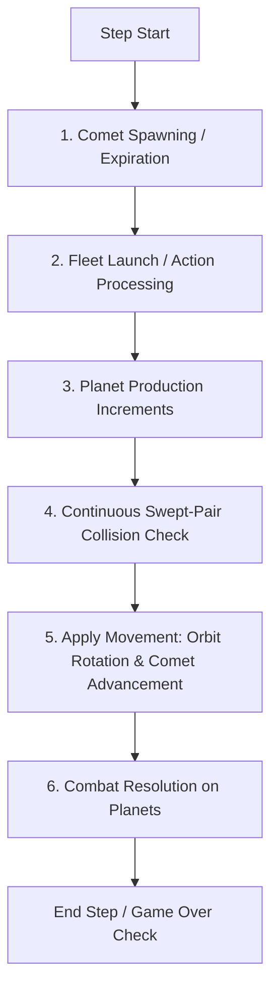

# Orbit Wars: C vs. Python Technical Specification & Parity Guide

This guide details the structural layout, physics execution, random seed mapping, and verification commands for the fast C-based simulator (`ocean/orbit_wars/orbit_wars.h`, `binding.c`) in comparison to the original Python `kaggle_environments` Orbit Wars implementation (`orbit_wars.py`).

---

## 1. Memory Layout & Correspondence

To perform direct memory copies and comparison, the C structure layouts map directly to `ctypes` structures in Python.

### Component Structure Mapping

| Entity | C Structure (`orbit_wars.h`) | Python `ctypes` Class (`test_orbit_wars_parity.py`) | Reference Python representation |
| :--- | :--- | :--- | :--- |
| **Planet** | `PlanetC` (40 bytes) | `class PlanetC(ctypes.Structure)` | Named tuple: `Planet` (ID, owner, x, y, radius, ships, production) |
| **Fleet** | `FleetC` (64 bytes) | `class FleetC(ctypes.Structure)` | Named tuple: `Fleet` (ID, owner, x, y, angle, from_planet, ships) |
| **Comet Group** | `CometGroupC` (6440 bytes) | `class CometGroupC(ctypes.Structure)` | Dictionary holding symmetric path coordinates |
| **Action** | `RawActionC` (16 bytes) | `class RawActionC(ctypes.Structure)` | `[from_planet_id, angle, ships]` |
| **Simulator** | `OrbitWars` | `class OrbitWarsStruct(ctypes.Structure)` | The core workspace environment |

> [!NOTE]
> All continuous fields (coordinates, velocities, angles, orbits) are implemented with **double precision** (`double` in C, `ctypes.c_double` in Python) to prevent micro-drift during floating-point operations.

---

## 2. Turn Execution Phases & Order

To maintain exact mathematical parity across multiple simulation steps, both implementations execute physics phases in the identical sequence:



### Key Equivalences to Inspect:

1. **Fleet launch offset**: Both implementations spawn fleets just outside the planet's radius to prevent immediate self-collision:
   $$\text{spawn\_pos} = \text{planet\_pos} + (\text{planet\_radius} + 0.1) \times (\cos\theta, \sin\theta)$$
2. **Speed scaling**: Fleet speed scales non-linearly with ship count:
   $$\text{speed} = \min\left(1.0 + (\text{max\_speed} - 1.0) \times \left(\frac{\ln(\text{ships})}{\ln(1000)}\right)^{1.5}, \text{max\_speed}\right)$$
3. **Continuous collision math**: Fleet collisions are resolved using swept-pair linear chord approximations to determine whether a moving fleet intersects a moving planet body during a single tick.
   * Python: `swept_pair_hit(A, B, P0, P1, r)`
   * C: `ow_swept_pair_hit(ax, ay, bx, by, p0x, p0y, p1x, p1y, radius)`

---

## 3. RNG Seed Space & Variation Parity

* **Seed Range**: Python `kaggle_environments` Orbit Wars works with a 31-bit seed space ($2^{31}$ range). The C simulator uses standard `rand_r(unsigned int* seed)` which takes a 32-bit state pointer, covering the entire 31-bit seed range.
* **Distribution Space**:
  Both generators use the same bounds and mathematical limits:
  * Planet count: $5 \text{ to } 10$ groups (i.e. $20 \text{ to } 40$ planets)
  * Angular velocity: $[0.025, 0.05]$ radians/step
  * Planet production: $1 \text{ to } 5$ ships/step
  * Comet speed: $4.0$ units/step
* **Seed Correspondence**:
  Because Python utilizes the Mersenne Twister algorithm (`random.Random`) and C uses the glibc LCG (`rand_r`), the **same seed value (e.g. 42) will generate different starting map layouts**.
  However, the **distribution space** of generated environments (density of planets, production velocity, orbital radius ratios) is mathematically identical. Your model will train on the exact same statistical distribution of environments.

---

## 4. Rollout Parity Verification Setup

Can we feed the same initial conditions to both simulators and run them step-by-step to check if their states are identical?

**Yes, this is exactly what the rollout parity test does.**
1. The parity script resets the Python environment to generate initial maps.
2. The initial positions, owners, ships, and angular velocities are injected directly into the C struct via `copy_state_py_to_c`.
3. For $500$ steps, both simulators receive the **exact same actions** and run their physics solvers independently.
4. **Comet Trajectory Exception**: Because comets are spawned inside Python using the Mersenne Twister RNG, their random entry trajectories are copied to C during spawn steps ($50, 150, \dots$) using `copy_comets_py_to_c`.
5. At every single step, we assert:
   * **Planet count** and **individual positions, owners, production, and ship counts** match exactly.
   * **Active fleet counts, positions, headings, and ship counts** match exactly.
   * **Computed agent observation arrays** match exactly.

---

## 5. Cheat Sheet: Build & Run Commands

Keep this list handy to build, test, and run the simulator without having to re-derive commands.

### Build the PufferLib C Environment
```bash
# Build with CPU backend (default)
bash build.sh orbit_wars --cpu

# Build with profiling tools enabled
bash build.sh orbit_wars --profile
```

### Run the Parity Test Suite
Compares single-step transitions and independent multi-step rollouts:
```bash
.venv/bin/python tests/test_orbit_wars_parity.py
```

### Run the PufferLib Environment Test Suite
Performs build checks, vector creation, smoke stepping, obs validation, episode termination checks, and benchmarks:
```bash
.venv/bin/python tests/test_orbit_wars.py
```
