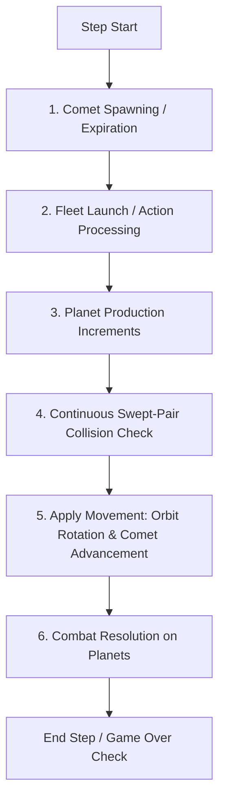

# Orbit Wars: C vs. Python Technical Parity & Architecture Specification

This specification documents the structural layout, physics execution, random seed spaces, and observation/reward mapping of the high-performance C-based simulator (`ocean/orbit_wars/orbit_wars.h`, `binding.c`) in comparison to the original Python `kaggle_environments` Orbit Wars implementation (`orbit_wars.py`).

---

## 1. Memory Layout & Correspondence

To perform direct memory copies and comparison, the C structure layouts map directly to `ctypes` structures in Python.

### Component Structure Mapping

| Entity | C Structure (`orbit_wars.h`) | Python `ctypes` Class (`test_orbit_wars_parity.py`) | Reference Python representation |
| :--- | :--- | :--- | :--- |
| **Planet** | `PlanetC` (40 bytes) | `class PlanetC(ctypes.Structure)` | Named tuple: `Planet` (ID, owner, x, y, radius, ships, production) |
| **Fleet** | `FleetC` (64 bytes) | `class FleetC(ctypes.Structure)` | Named tuple: `Fleet` (ID, owner, x, y, angle, from_planet, ships) |
| **Comet Group** | `CometGroupC` (6440 bytes) | `class CometGroupC(ctypes.Structure)` | Dictionary holding symmetric path coordinates |
| **Action** | `RawActionC` (16 bytes) | `class RawActionC(ctypes.Structure)` | `[from_planet_id, angle, ships]` |
| **Simulator** | `OrbitWars` | `class OrbitWarsStruct(ctypes.Structure)` | The core workspace environment |

> [!NOTE]
> All continuous fields (coordinates, velocities, angles, orbits) are implemented with **double precision** (`double` in C, `ctypes.c_double` in Python) to prevent micro-drift during floating-point operations.

---

## 2. Turn Execution Phases & Order

To maintain exact mathematical parity across multiple simulation steps, both implementations execute physics phases in the identical sequence:



### Key Equivalences to Inspect:

1. **Fleet launch offset**: Both implementations spawn fleets just outside the planet's radius to prevent immediate self-collision:
   $$\text{spawn\_pos} = \text{planet\_pos} + (\text{planet\_radius} + 0.1) \times (\cos\theta, \sin\theta)$$
2. **Speed scaling**: Fleet speed scales non-linearly with ship count:
   $$\text{speed} = \min\left(1.0 + (\text{max\_speed} - 1.0) \times \left(\frac{\ln(\text{ships})}{\ln(1000)}\right)^{1.5}, \text{max\_speed}\right)$$
3. **Continuous collision math**: Fleet collisions are resolved using swept-pair linear chord approximations to determine whether a moving fleet intersects a moving planet body during a single tick.
   * Python: `swept_pair_hit(A, B, P0, P1, r)`
   * C: `ow_swept_pair_hit(ax, ay, bx, by, p0x, p0y, p1x, p1y, radius)`

---

## 3. Function-to-Function Correspondence

The simulation logic in the C implementation matches the original Python codebase structure:

| Python Function (`orbit_wars.py`) | C Function / Phase (`orbit_wars.h`) | Description |
| :--- | :--- | :--- |
| `generate_planets(rng)` | `ow_generate_map(env)` | Sets up the initial map of symmetric static and orbiting planets. |
| `generate_comet_paths(...)` | `ow_generate_comet_path(env, idx)` | Simulates gravity deflection of 4 symmetric comet trajectories. |
| `interpreter(...)` (Launch) | `ow_phase_fleet_launch(env)` | Spawns fleets at dynamic coordinates outside planets based on inputs. |
| `interpreter(...)` (Production) | `ow_phase_production(env)` | Increments owned planets' ship counts by their production values. |
| `interpreter(...)` (Swept Collision) | `ow_phase_fleet_movement(env)` | Simulates continuous swept-pair checks with moving planets/sun/comets. |
| `interpreter(...)` (Movement) | `ow_phase_rotation_and_comets(env)`| Rotates orbiting planets and advances comet indexes. |
| `interpreter(...)` (Combat) | `ow_phase_combat_resolution(env)` | Sums arriving fleets per planet to compute ownership transitions. |
| `interpreter(...)` (Game Over) | `ow_check_game_over(env)` | Triggers terminal states on step limits or when only one agent remains. |

---

## 4. Observation & Reward Scaling

To ensure stable gradient descents during reinforcement learning, PufferLib expects observations and rewards to reside in standardized, well-scaled bounds.

### Observation Cast & Scaling Layout
While internal physics use high-precision doubles, observations are cast to single-precision `float` when copying to the neural network memory buffer (`env->obs_ptr[a]`). All observations are scaled to fall within $[-1, 1]$ or $[0, 1]$:

```c
/* Extracts a 6484-float array of features per agent */
obs[idx++] = pl->x / OW_BOARD_SIZE;                  // [0.0, 1.0] board positions
obs[idx++] = pl->y / OW_BOARD_SIZE;
obs[idx++] = pl->radius / 5.0f;                     // [0.2, 1.0] radius scaling
obs[idx++] = (float)pl->ships / 1000.0f;             // Normalizes ship densities
obs[idx++] = (float)pl->production / 5.0f;          // Normalizes production rate
obs[idx++] = fl->angle / (2.0f * M_PI);             // [0.0, 1.0] angle buckets
obs[idx++] = env->angular_velocity / 0.05f;          // [0.5, 1.0] velocity ratio
obs[idx++] = (float)env->current_step / 500.0f;     // [0.0, 1.0] time encoding
obs[idx++] = (float)my_ships / 1000.0f;             // Normalizes total armies
```

### Reward Range Layout
Rewards are sparse terminal outcomes calculated at the end of the episode and mapped between $[0, 1]$:
* **Winner**: `1.0f`
* **Tie/Draw**: `0.5f`
* **Loser**: `0.0f`
* **Intermediate steps**: `0.0f`

---

## 5. RNG Seed Space & Variation Parity

* **Seed Range**: Python `kaggle_environments` Orbit Wars works with a 31-bit seed space ($2^{31}$ range). The C simulator uses standard `rand_r(unsigned int* seed)` which takes a 32-bit state pointer, covering the entire 31-bit seed range.
* **Distribution Space**:
  Both generators use the same bounds and mathematical limits:
  * Planet count: $5 \text{ to } 10$ groups (i.e. $20 \text{ to } 40$ planets)
  * Angular velocity: $[0.025, 0.05]$ radians/step
  * Planet production: $1 \text{ to } 5$ ships/step
  * Comet speed: $4.0$ units/step
* **Seed Correspondence**:
  Because Python utilizes the Mersenne Twister algorithm (`random.Random`) and C uses the glibc LCG (`rand_r`), the **same seed value (e.g. 42) will generate different starting map layouts**.
  However, the **distribution space** of generated environments (density of planets, production velocity, orbital radius ratios) is mathematically identical. Your model will train on the exact same statistical distribution of environments.

---

## 6. Rollout Parity Verification Setup

Can we feed the same initial conditions to both simulators and run them step-by-step to check if their states are identical?

**Yes, this is exactly what the rollout parity test does.**
1. The parity script resets the Python environment to generate initial maps.
2. The initial positions, owners, ships, and angular velocities are injected directly into the C struct via `copy_state_py_to_c`.
3. For $500$ steps, both simulators receive the **exact same actions** and run their physics solvers independently.
4. **Comet Trajectory Exception**: Because comets are spawned inside Python using the Mersenne Twister RNG, their random entry trajectories are copied to C during spawn steps ($50, 150, \dots$) using `copy_comets_py_to_c`.
5. At every single step, we assert:
   * **Planet count** and **individual positions, owners, production, and ship counts** match exactly.
   * **Active fleet counts, positions, headings, and ship counts** match exactly.
   * **Computed agent observation arrays** match exactly.

---

## 7. Cheat Sheet: Build & Run Commands

Keep this list handy to build, test, run, and train the simulator without having to re-derive commands.

### Build the PufferLib C Environment
```bash
# Build with CPU training backend (default)
bash build.sh orbit_wars --cpu
```

### Run the Parity Test Suite
Compares C simulator step-by-step and independent multi-step rollouts against original Python:
```bash
.venv/bin/python tests/test_orbit_wars_parity.py
```

### Run the PufferLib Environment Test Suite
Performs smoke tests, vector resets, observation validation, episode terminal checks, and benchmarks:
```bash
.venv/bin/python tests/test_orbit_wars.py
```

### Run Google Colab Verification
To run tests on a Google Colab instance from your local machine, use the `colab` CLI tool. The environment setup and test runners are decoupled to run within the default 30-second cell execution limits:

1. **One-time Setup**:
   ```bash
   colab new
   colab exec -f colab_setup.py
   ```
2. **Build and Environment Tests**:
   ```bash
   colab exec -f colab_build.py 2>&1 | tee colab_build_run.log
   ```
3. **C vs Python Parity Tests**:
   ```bash
   colab exec -f colab_parity.py 2>&1 | tee colab_parity_run.log
   ```

### Train the Agent (CPU)
PufferLib reads default configurations directly from the [config/orbit_wars.ini](file:///home/dima/dev/PufferLib-4.0/config/orbit_wars.ini) file. 

To configure 1v1 vs. 4v4 training modes, or scale resource limits, edit `orbit_wars.ini`:
* **Player Count**: Update `num_agents = 2` (1v1) or `num_agents = 4` (4v4) in the `[env]` section.
* **Environment Count**: For local CPU training, reduce `total_agents` under `[vec]` to a reasonable number (e.g., `256` or `512`) to manage memory.

Run training using the standard PufferLib train CLI:
```bash
puffer train orbit_wars
```
*(PufferLib automatically detects CPU build settings from `pufferlib._C` and falls back to CPU execution device paths).*
